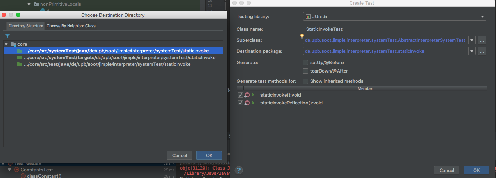
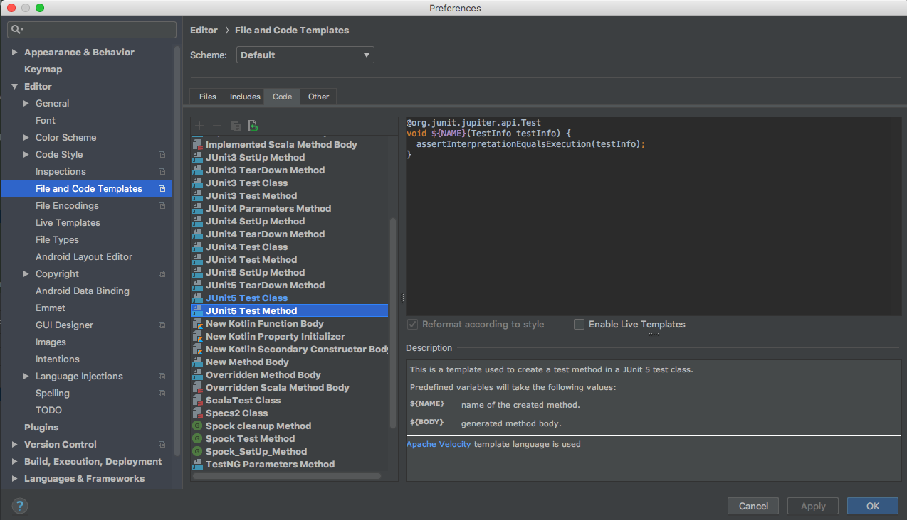

# Jimple-Interpreter
Concrete interpreter for Soot's Java intermediate representation Jimple (with ambitions to be extended for symbolic/concolic execution).

**Let's get this done, Panathon!**

## Setup

1. Give me (Manuel) your GitHub account name, so that I can give you write access to this repo ! :)
2. Clone repo with `git clone --recurse-submodules https://github.com/secure-software-engineering/Jimple-Interpreter.git`
3. Run `mvn install` in the *root* directory1  (This will fail as soon as the tests of the *core* project are executed, which is totally fine!)
4. From now on it is sufficient to run `mvn clean test` in the `core` directory to build and run tests
5. Import the whole `Jimple-Interpreter` (the *root*) directory into an IDE of your choice. Make sure to import it as a Maven project and to include all submodules since this is a Maven multi module project
    - From here on paths and commands are relative to the `core` directory
6. You can find the interpreter's source code in `src/main/java` and a lot of (not-yet-passing) test cases in `sry/systemTest/java`2. Since we had to use some Maven wizardry to get things to work as they do, your IDE might not be able to detect `src/systemTest/java` and `src/systemTest/targets` as "Test Sources Root" and `src/systemTest/resources` as "Test Resources Root". Make sure to configure your IDE accordingly to get the full support when working at test cases and test targets (code to-be-analyzed)3
7. You are ready to go! Try to run the test cases in `src/systemTest/java` inside your IDE. 12 of the test should already be passing!
8. It might be a good idea to debug through one of the already passing test cases to get some insights on how the interpreter is generally working

1 We will foremost work on the *core* project which is located in `<root>/core`. Since we might need to change some things in *Soot* itself, I included a fork of *Soot* in `<root>/soot` which we can modify to our needs. To not recompile and test Soot everytime we make a change in the *core* project, it is sufficient to run `mvn clean install` once in the *root* directory and then only if we made a change to Soot again.

2 When writing test cases, we distinguish unit and system tests. If you want to write a test for only a sub-component or class of the interpreter, please put those into `src/test/java`. System tests, on the other hand, are used to test the interpreter as a whole, i.e., by interpreting a piece of Jimple code and expecting a certain output/result. 

3 In IntelliJ IDEA this can be done by right clicking on the folder and then "Mark Directory as". In Eclipse this has to be set via the "java build path" settings.

## Coding together

For the contest, we have prepared about 200 test cases of which we will try to get as many as possible to pass.
Therefore, we will gather in groups working on the [Tasks](#Tasks) which try to separate functionality to independent working blocks. Of course, these are not always completely independent from each other. This shouldn't be too bad since, after all, we of course want to create something together :). So make sure to communicate with the other groups if you are stuck or have ideas for their tasks.

Nevertheless, we want to make distributed coding as painless as possible. Thus, the `develop` branch is write protected. Make sure that one member of your team creates a branch for your team by invoking `git checkout -b <branchname>` before starting to code.
After pushing this branch back to the repository, your fellow team mates can then work on this branch by pulling and checking it out locally. Of course, you are free to create as many branches as you need! 

If you finished a task or think you changed the codebase in a way that other teams will also benefit from, make a **pull-request** against the `develop` branch. I will then give it a quick look and merge it back if there are no conflicts (Thus, make sure to eliminate possible conflicts that may have risen due to other teams changes). 

This should allow us to work independently but still profit from the improvements of each team. 

 

## Tasks

> Feel free to further separate the tasks as needed!

### Method invocation and dynamic dispatch

###### Current state
- virtualinvoke is the only implemented invoke statement and does lack support for dynamic dispatch. 

###### TODO
- Implement other invokes
- Implement inheritance and dynamic dispatch
- Implement interface spport

###### Hints 
- staticinvoke can be implemented independently since it is unaffected by inheritance
- dynamic invoke should also be a good package on its own
- `de.upb.soot.jimple.interpreter.AbstractValueInterpreter` contains stubs for the invokes
- `de.upb.soot.jimple.interpreter.values.JObject` might be a good place to implement dynamic dispatch

###### Test case packages
- objects
- inheritance
- interfaces
- staticInvoke
- lambdaExpressions

### Field references

###### Current state
- static field reference does work partly  

###### TODO
- Implement write/read access to/from (static) fields

###### Hints 
- implement in `de.upb.soot.jimple.interpreter.AbstractValueInterpreter` and `de.upb.soot.jimple.interpreter.values.JObject`
- Since fields can be located in super classes and overwritten, this is partly dependant on the inheritance task

###### Test case packages
- staticFields
- fieldReference

### Operators

###### Current state
- none

###### TODO
- Implement all kinds of operators on various Java data types

###### Hints 
- `de.upb.soot.jimple.interpreter.concrete.ConcreteValueInterpreter` should contain most of the needed stubs

###### Test case packages
- operators

### Control statements

###### Current state
- none

###### TODO
- Implement loops and conditionals
- Implement exceptional control flow

###### Hints 
- There are currently no tests for exceptional control flow. Feel free to add some and make them pass!
- The `interpret` methods in `de.upb.soot.jimple.interpreter.JimpleInterpreter` will probably need a rework to enable control flow branching

###### Test case packages
- controlStatements
- nestedControlStatements (depends on controlStatements and arrays!)

### Misc

###### Current state
- none

###### TODO
- improve error messages (high priority)
    - currently error messages give very few information on what went wrong. It might be a good idea to throw a dedicated `InterpretException` which is appended with additional information on each level of the interpretation process.
- Implement array handling (high priority)
- Fix class, short and byte constants (high priority)
    - short/byte constants do not work since we do not interpret the right side of an assignment dependent on the type of the left side in `de.upb.soot.jimple.interpreter.StmtInterpreter.caseAssignStmt`
    - it might be a good idea to rework the whole local handling as it currently is
- Implement generics (low priority)
    - since type information is absent in bytecode, this might not even need a change. However, generics for emulated classes (see following task) might be a whole different kind of beast.
- Write cli (low priority)
    - the CLI project already contains a basic setup for a command line interface but still needs to be implemented.
- Implement possibility to start interpretation in the middle of an (instance) method. (low priority)
    - For instance methods, we need to fake a initialized `this` reference to not crash on the first field or method access

###### Test case packages
- arrays
- generics
- constants

### Jimple<->Java object conversion and emulation

This is needed when calling native methods that require Java objects as parameters or receiver. Our internal object representation (`JObject`) has to be converted to a native Java object.

Also, if we do not want to interpret the JDK or other libraries, it would make sense to "emulate" them by using the real objects. We will also have to convert our internal objects to Java objects and back to be able to pass objects into/out-of the Java library.

###### Current state
- System.out/err/in is emulated as Build-in

###### Hints 
- [objenesis](https://github.com/easymock/objenesis) is a library that allows to construct Java objects without calling the constructor
    - we need exactly this to not execute the constructor since this could a) diverge object state and b) introduce duplicate execution when creating a Java object to fill with the current state of a `JObject`
- decide if something should be emulated based on if it is phantom or it can be found in the given classpath

###### Test case packages
- emulation
- everything that uses library class except `System.out`, e.g., `de.upb.soot.jimple.interpreter.systemTest.controlStatements.ControlStatements.forIterList`

## Writing or changing system tests

> The existing test cases are really just a starting point. Make sure to add test cases for all sorts of corner cases you can come up with!

The system test directory structure looks as follows:

Directory | Purpose 
--- | --- 
`src/systemTest/targets` | Contains Java **target** code that will be converted to Jimple and then interpreted. 
`src/systemTest/java` | Contains Java test code which is used to test the interpreter. 
`src/systemTest/resources` | Contains resource files that will be copied to the output directory and are accessible by the test cases by using the Java resource mechanism. 

Usually, a test will run the interpreter on a **target** (a method in a class located in `src/systemTest/targets` )and then compare the output with the expected behavior. The easiest way to do this is by deriving from `de.upb.soot.jimple.interpreter.systemTest.AbstractInterpreterSystemTest` and then calling `assertInterpretationEqualsExecution` in the test case. This will compare the interpreted output with the output that is generated by executing the target directly.

In any case, make sure to derive your test class form `de.upb.soot.jimple.interpreter.systemTest.AbstractInterpreterSystemTest` to be able to use the **target** code inside your test cases.

##### Note:

- Make sure to run `mvn clean test` if you changed the test **targets**, even if you want to execute the tests themselves in the IDE, since your IDE might not support the special folder structure.
- `de.upb.soot.jimple.interpreter.systemTest.AbstractInterpreterSystemTest.assertInterpretationEqualsExecution` makes various assumptions on the naming of test cases. Make sure to read the JDoc for more information.
    - In short: The test method needs to have the same name as the target method and the class containing the test method has to be named `<targetclassname>Test`
- Since only *targets* with corresponding test cases are analyzed, only *targets* with test cases will be found as Jimple in the `core/JimpleOutput` directory.
- All pieces of a test case have to be in the same package or a sub package of the tested class! Do not use classes of other packages in your target code!
- Make sure to use the JUnit5 (Jupiter) API and nothing else! Your idea may sometimes include the JUnit4 package when using `@Test`.

#### In IntelliJ IDEA it is pretty easy to generate a system test:

1. Write a *target* method that should be interpreted (method with no arguments and arbitrary return type) in a class located in `src/systemTest/targets`
2. If the target class already has a corresponding *test* class in `src/systemTest/java`, just `alt+enter` with the cursor on the new method and then select `Generate missed test methods`.
3. ...if not, `alt+enter` with the cursor on the class name and select `create Test`. You will be presented with a dialog like this one:

> Make sure to select `de.upb.soot.jimple.interpreter.systemTest.AbstractInterpreterSystemTest` as *Superclass* and select **JUnit5** as testing framework. Also make sure to select `src/systemTest/Java` as target folder when asked for it and keep the *package* as is.

If you find yourself generating a lot of test methods which are always just calling `assertInterpretationEqualsExecution`, you can even fully automate the process by modifying the default method stub for test method in the preferences:

## Remember

- Do not forget to run `mvn clean test` to (re-)generate the test targets if they were changed or extended. The IDE does not cover this behavior.
- All Maven commands can be executed on specific sub-project if all dependent sub-projects can be found in the local Maven repository. Thus, if you want to avoid rebuilding Soot each time when only wanting to test a specific submodule, execute `mvn clean install` in the root directory and execute further Maven commands in the submodules directory. Remember to reinstall Soot if source code changes.
- You can always have a look at the generated Jimple for a specific test *target* by opening the corresponding Jimple file in the `core/jimpleOutput` directory.
    - Jimple files are only generated for classes which have a corresponding test case. If you want to get a fast impression of how the Jimple representation for a specific Java code would look like, without the need for a test case, just add a method to the `de.upb.soot.jimple.interpreter.systemTest.jimpleShowcase.JimpleShowcaseTest` class, re-invoke `mvn clean test` and you should be able to find the Jimple code for your method in `core/jimpleOutput`.
      > However, most of the time it would be better to create a new test case instead of this dummy behavior.
- Please feel free to commit improvements to this readme if you think your fellow hackers could profit from it!

## Troubleshooting

- If Maven throws certificate exceptions when trying to access Soot's Maven repository, you can very likely fix this by updating your Java version.

## Most importantly
**Have fun! :)**